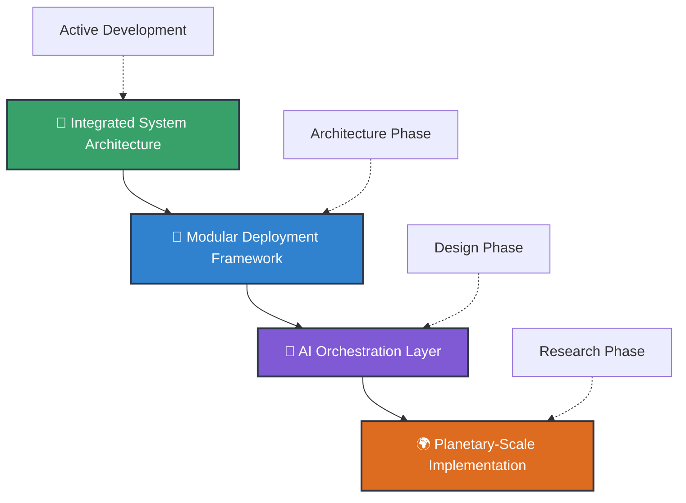

  

  

📍 **Canada** | 🌐 **[Planetary Restoration Archive](https://planetaryrestorationarchive.com)**

  
  
  

**📧 admin@planetaryrestorationarchive.com**

---

## 🌍 Mission Statement

I architect **regenerative systems** that bridge AI intelligence with ecological wisdom, designing open-source frameworks for planetary restoration and decentralized resilience. My work focuses on creating comprehensive system blueprints for transforming buildings into living ecosystems, developing AI-orchestrated environmental networks, and architecting technologies that serve life rather than extraction.

**Current Focus:** System architecture and development of integrated regenerative technology frameworks, with emphasis on scalable deployment patterns and modular system design.

 

---

## 📊 GitHub Analytics

  
  

  

  

---

## 🛠️ Technology Stack & Architecture Focus

### **System Architecture & Infrastructure**

### **AI & Machine Learning**

### **Web Development & APIs**

### **Blockchain & Decentralized Tech**

### **Environmental & IoT**

---

## 🚀 Featured System Architecture Projects

<table>
<tr>
<td width="50%">

<h3 align="center">🔬 MycoThermSeed™</h3>

  

<strong>Thermophilic Fungal Carbon Capture</strong> 
Self-regenerating biofilter architecture with distributed sensor integration and thermal regulation systems.

</td>
<td width="50%">

<h3 align="center">🌍 GERE Framework</h3>

<strong>Planetary-Scale Restoration Network</strong> 
Decentralized sensor network design for bioregional environmental monitoring and restoration.

</td>
</tr>
<tr>
<td width="50%">

<h3 align="center">🧱 Lightforge Platform</h3>

<strong>Gamified Emotional Intelligence</strong> 
Progressive Web App structure for behavior transformation in educational and community settings.

</td>
<td width="50%">

<h3 align="center">🌫️ EcoDraft + SkyWeave™</h3>

<strong>Building-Integrated Atmospheric Processing</strong> 
Modular retrofit framework for energy generation and air quality improvement systems.

</td>
</tr>
</table>

---

## 🎯 Current Development Focus

**🔄 Integrated System Architecture** *(Active Development)*  
Designing unified protocols that allow all regenerative systems to communicate and coordinate through standardized APIs and data exchange formats.

**📐 Modular Deployment Framework** *(Architecture Phase)*  
Creating standardized system components that can be mixed and matched based on local environmental conditions and community needs.

**🤖 AI Orchestration Layer** *(Design Phase)*  
Architecting intelligent coordination systems that can manage multiple regenerative technologies simultaneously across diverse deployment environments.

---

## 🤝 Collaboration Opportunities

| **Seeking** | **Focus Area** | **Contribution** |
|-------------|----------------|------------------|
| 🔬 **Research Institutions** | Systematic regenerative tech integration | Academic rigor + real-world application |
| 💻 **Systems Engineers** | Large-scale environmental architecture | Technical expertise + sustainable impact |
| 🏢 **Organizations** | Comprehensive regenerative frameworks | Operational experience + system validation |
| 💰 **Impact Investors & DAOs** | Open-source architectural development | Capital + community governance |

**Looking for:** Systems architects, environmental engineers, AI developers, and sustainability professionals who understand that robust system design is the foundation for meaningful environmental impact.

---

## 📚 Development Philosophy & Approach

<strong>🏗️ System Design Philosophy</strong>

 
My approach emphasizes creating comprehensive architectural frameworks before implementation, ensuring that every system component is designed for scalability, modularity, and integration with other regenerative technologies. This methodology reduces deployment risks and maximizes long-term effectiveness.

<strong>🔓 Open Source Commitment</strong>

 
All system architectures and development frameworks are designed to be completely transparent, allowing other developers to understand, modify, and improve upon the fundamental design patterns. This approach accelerates innovation across the entire regenerative technology ecosystem.

<strong>🏘️ Community Development</strong>

 
I focus on creating system architectures that can be implemented by local communities with varying technical capabilities, ensuring that sophisticated regenerative technologies remain accessible rather than requiring advanced technical expertise for deployment.

---

## 📄 Licensing & Ethics

**Open Source Commitment:** All repositories follow [CC BY-NC-SA 4.0](https://creativecommons.org/licenses/by-nc-sa/4.0/) licensing

| ✅ **Allowed** | ❌ **Prohibited** |
|----------------|-------------------|
| Free adaptation & extension (non-commercial) | Profit-driven resale or access restriction |
| Knowledge sharing with attribution | Extractive commercialization |
| Community ownership & collaboration | Proprietary system lock-in |
| Mission-aligned purposes | Environmental harm or exploitation |

---

## 🏆 Recognition & Achievements

---

## 🎮 When I'm Not Architecting Regenerative Systems

  

---

## 🌟 Ready to Architect Regenerative Systems Together?

### 💫 *"Regenerative technology begins with regenerative architecture - systems designed from the ground up to serve life, enhance ecosystem health, and remain forever open to those who need them most."*

---

